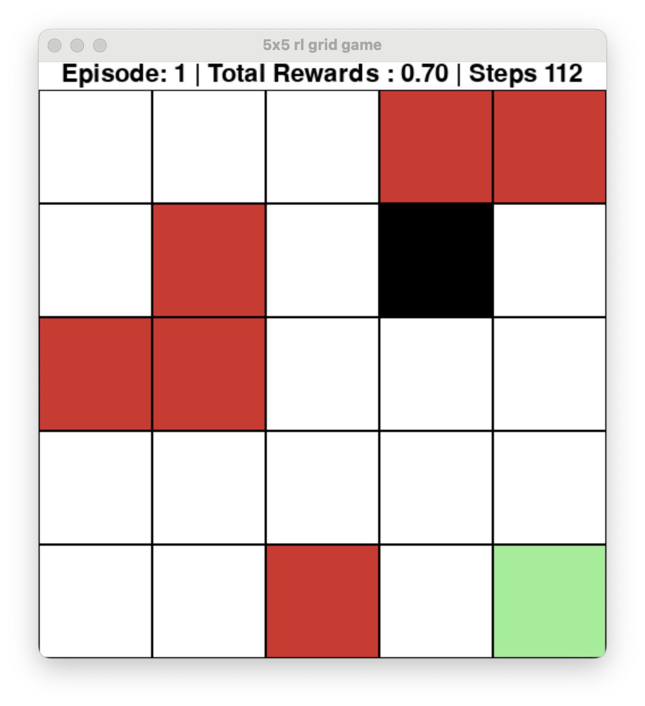

# Reinforcement leanring - Q-Learning in Pygame 

GridWorld is a game where an agent navigates a grid to reach a goal while avoiding obstacles. The agent learns over time how to best navigate the grid by learning from its experience the implementation of the Q-learning algorithm. A visual animation of the agent’s learning process is displayed using Pygame.

<!--  -->

## Features
 - Dynamic environments.
 - Epsilon-greedy policy.
 - Save and load Q-tables.
 - Visual animation using Pygame.

## Usage 
Python main.py

## Installation 
pip install -r requirements.txt

## Acknowledgments

I would like to acknowledge the contributions of [Contributor's GitHub Page](https://github.com/cristianleoo/Reinforcement-Learning.git) for providing valuable insights into reinforcement learning and for providing the initial code.

## Licence 
This project is licensed under the MIT License - see the LICENSE file for details.
